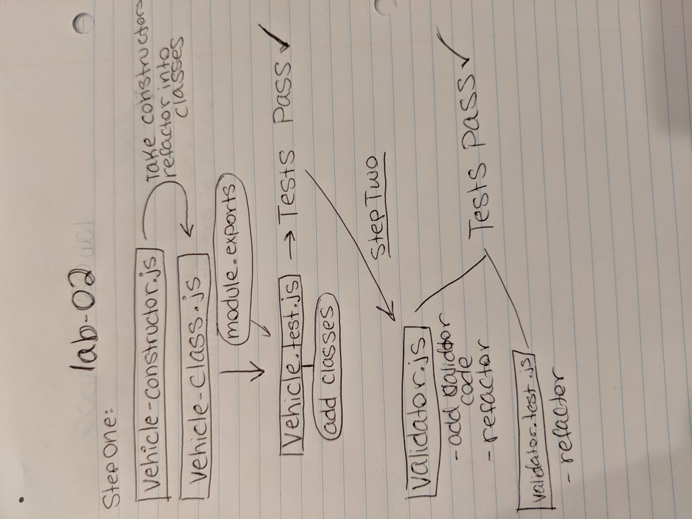

# LAB 02

## Classes, Inheritance, Functional Programming

### Author: Natalie Alway

### Links and Resources
* [submission PR](https://github.com/nataliealway-401-advanced-javascript/lab-02-classes/pull/1)
* [travis](https://www.travis-ci.com/nataliealway-401-advanced-javascript/lab-02-classes)

#### Documentation
* JSDoc - cd to docs, and run live-server

### Modules
index.js
validator.js
vehicles-class.js
vehicles-constructors.js

#### How to initialize/run your server app (where applicable)
`npm start`

  
#### Tests
* How do you run tests?
`npm test` `npm run lint`

#### UML

